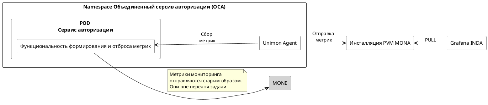

# Руководство по системному администрированию

Документ содержит названия переменных, одинаково применимых для различных сред контейнеризации, указанных в системных требованиях. Имя переменной не определяет конкретную среду контейнеризации.

## Сценарии администрирования

Типовыми сценариями администрирования компонента OCA являются:

1. Просмотр журнала событий компонента ОСА.
2. Настройка взаимодействия компонента ОСА через mTLS с использованием ОТТ.
3. Настройка подключения по mTLS к базе данных PostgreSQL.
4. Предоставление Суперадминистратором доступа в АРМ Администратора ОСА для Платформенных и Канальных администраторов.
5. Использование протокола SCIM для выгрузки ролей.
6. Включение КВР для проектной области.

### Просмотр журнала событий компонента ОСА

> **Примечание**  
> Требуемые привилегии: роль **EFS_JOURNAL_ADMIN** в компоненте **Журналирование**.

Чтобы посмотреть логи запросов и ответов к компоненту ОСА, воспользуйтесь сервисом **Просмотр журналов** в компоненте **Журналирование**. Необходимые логи содержатся в разделе **Интеграционный журнал**.
При поиске укажите временной промежуток, в течение которого была попытка входа. Будьте внимательны с указанием даты и времени. Для Кода подсистемы выберите вариант **ФП Сервис авторизации (AUTHORIZATION)** и URL сервиса — `/ufs-security/rest/v2/priviliges/get`.
Для детализации поиска можно указать Идентификатор сессии пользователя.

После того как нужная запись в журнале обнаружена, изучите запись.
Ответ на запрос будет содержать все рассчитанные для пользователя привилегии и группы.
Если для указанных в запросе атрибутов модель авторизации не вычисляется, ответ будет пустым *(?)*.

### Настройка взаимодействия компонента ОСА через mTLS с использованием ОТТ

> **Примечание**  
> Требуемые привилегии: роль **Суперадминистратор**.

#### Настройка mTLS

Для зашифрованного обмена данными и проверки подлинности запроса с использованием mTLS в конфигурационном файле *vs-egress-ott.yaml* используется три параметра:

* Два параметра из URL: `host` и `port`;
* глобальная переменная: `${global.rest.platformAuthServerUrl.ip|}`.

Ниже приведён пример фрагмента конфигурационного файла *vs-egress-ott.yaml*. Используйте его при настройке обмена данными.

```yml




apiVersion: networking.istio.io/v1alpha3
kind: ServiceEntry
metadata:
  name: egressgateway-keycloak-ufs-security-${distrib.release.version}
spec:
  addresses:
    - ${spas.rest.platformAuthServerUrl.ip}
  endpoints:
    - address: ${spas.rest.platformAuthServerUrl.ip}
  exportTo:
    - .
  hosts:
    - {{ keycloak_host }}  
  location: MESH_EXTERNAL
  ports:
    - name: tls-{{ keycloak_port }}
      number: {{ keycloak_port }}
      protocol: TLS  
    - name: tls-8443
      number: 8443
      protocol: TLS
  resolution: DNS
```

**Примечание:** выпуск сертификата производит администратор стенда. Все сертификаты будут находиться в хранилище сертификатов Ingress и Egress на стенде в репозитории common.

#### Настройка OTT

Для настройки ОТТ необходимо для параметров компонента ОСА определить следующие глобальные переменные '${global.*}' в конфигурационных файлах `ufs-security.ott-sidecar-ufs.all.conf` + `ufs-security.istio.all.conf`:

|                 Имя параметра                  | Глобальная переменная               | Описание                                                                                                                    |
|------------------------------------------------|-------------------------------------|-----------------------------------------------------------------------------------------------------------------------------|
| ott.ose.istio.deployment.spec.template.spec.containers.ott-sidecar.image | ${global.ott.image.sidecar.version} | Sidecar-образ для ОТТ-клиента.                                                                                               |
| ufs-security.ose.egress.ott.grpc.port | ${global.ott.grpc.port}             | Путь UNIX-сокета для сервиса Egress.                                                                                                 |
| ufs-security.ose.egress.ott.service.url | ${global.ott.service.url}           | Шаблон URL-сервиса OTT. При балансировке значения будут подставляться значением параметра `OTT_SERVICE_HOSTS` сервиса Egress.                       |
| ufs-security.ose.egress.ott.service.hosts | ${global.ott.service.hosts}         | Список хостов в формате `server:port` сервиса OTT для балансировки нагрузки (или аналогичный список nginx OTT (на НТ/ПСИ/Пром) для сервиса Egress).  |
| ufs-security.ose.ingress.ott.grpc.port | ${global.ott.grpc.port}             | Путь UNIX-сокета для сервиса  Ingress                                                                                                |
| ufs-security.ose.ingress.ott.service.url | ${global.ott.service.url}           | Шаблон URL-сервиса OTT. Gри балансировке значения будут подставляться значением параметра `OTT_SERVICE_HOSTS` сервиса Ingress.                      |
| ufs-security.ose.ingress.ott.service.hosts | ${global.ott.service.hosts}         | Список хостов в формате `server:port` сервиса OTT для балансировки нагрузки, или аналогичный список nginx OTT (на НТ/ПСИ/Пром) для сервиса Ingress. |

**Примечание:** выпуск сертификата осуществляет администратор стенда. Все сертификаты будут находиться в хранилище сертификатов egress на стенде в репозитории common.

### Настройка подключения по mTLS к базе данных PostgreSQL

> **Примечание**  
> Требуемые привилегии: роль **Суперадминистратор**.

Сервер PostgreSql поддерживает SSL/TLS. Создание ключей и сертификатов осуществляется с помощью библиотеки OpenSSL.

> Формат сертификатов X.509 (публичный ключ расположен в едином файле с сертификатом). Верификация владельца и расшифровка сообщений происходят с использованием одного публичного файла — сертификата.

Конфигурации клиентского сертификата производит администратор стенда, а конфигурацию серверного сертификата —  администратор СУБД.
1. Администратор стенда заносит приватный ключ и клиентский сертификат в репозиторий (common) настроек стенда и создаёт глобальные переменные с указанием путей к этим файлам.
2. Далее администратор создает глобальную переменную в конфигурационном файле *ufs-security-manager/dc.yaml* для строки подключения к БД (пример):

```conf
jdbc:postgresql://<адрес>:<порт>/autz?currentSchema=ufs_security_<ИмяСтенда>&ssl=true&sslmode=verify-full&sslfactory=org.postgresql.ssl.jdbc4.LibPQFactory&sslrootcert=/etc/config/ssl/db/root.pem&sslcert=/etc/config/ssl/db/ufs_security_<ИмяСтенда>.pem&sslkey=/etc/config/ssl/db/ufs_security_<ИмяСтенда>.pk8
```

Если защищенное соединение не требуется, то строка подключения принимает следующий вид:

```conf
jdbc:postgresql://<адрес>:<порт>/autz?currentSchema=ufs_security_<ИмяСтенда>&ssl=false
```

Параметр в репозитории конфигурации:

* `ufs-security.db.tls.enabled` — включение поддержки mTLS.

Глобальные переменные и их описание:

* `global.db.keyStore.keystore.keyStoreFromFile` — путь к хранилищу сертификатов в репозитории (common);
* `global.db.keyStore.password` — пароль для расшифровки хранилища сертификатов в репозитории (common).

### Предоставление Суперадминистратором доступа в АРМ Администратора ОСА для Платформенных и Канальных администраторов

> **Примечание**  
> Требуемые привилегии: роль **Суперадминистратор**.

1. Для платформенной и канальной изоляции будут использоваться роли сервиса аутентификации (например, KeyCloak.SE/СУДИР), поэтому сначала определите набор требуемых новых или имеющихся ролей в сервисе аутентификации.
> **Info:** Для изоляции конфигурации в разрезе сектора необходима отдельная роль.
> 
> **Tip:** Если с помощью вашего приложения изменяются настройки в трех разных канальных секторах,  потребуются 4 роли провайдера аутентификации (KeyCloak.SE/СУДИР):
> * роль Суперадминистратора с доступом ко всем конфигурациям;
> * по одной роли для каждого канального сектора.
2. Для канальной изоляции внесите изменения в файл конфигурации модели авторизации вашего приложения с использованием специализированного фильтра авторизации:

```xml
   <filter code="ManagePermissions.SectorChannelFilter">
   <param property="sectorChannels" type="list">
   <value>Название Канала</value>
```

Для платформенной изоляции при загрузке ролевой модели укажите параметр тенант-кода.

> **Примечание**  
> Требуемые привилегии: роль **Суперадминистратор**.

3. После создания необходимых ролей для изоляции войдите в консоль оператора компонента ОСА и загрузите ролевые модели через кнопку **Импорт**.
4. Для ограничения доступа (вкладка/действие) в консоли оператора компонента ОСА перейдите на вкладку **Набор привилегий**.
5. Через расширенный поиск в поле **Наименование** найдите недавно загруженный набор привилегий для канального или платформенного администратора.
6. Для редактирования набора нажмите кнопку **Редактировать набор привилегий** (пиктограмма зелёного карандаша) в поле **Действие**.
7. В разделе **Просмотр прав набора привилегий** в строке поиска наберите «**Управление правами доступа**». Появится список привилегий АРМ администратора.
8. В открывшемся окне в группе «Редактирование прав набора привилегий» нажмите «Управление ролями» из списка «Управление правами доступа» и нажмите кнопку **Редактировать** рядом с пунктом «Удалить роль».
9. В выпадающем списке «снимите» выбор с опции «Поддержка и сопровождение Сегмент Сотрудники» (пиктограмма «галочка») и нажмите кнопку **Сохранить** 
10. Набор привилегий пользователя изменен.

### Использование протокола SCIM для выгрузки ролей

> Необходимые привилегии:  
> роль Суперадминистратор.

SCIM (System for Cross-domain Identity Management) — система управления идентификацией для управления учетными данными пользователей в кросс-доменной среде. Система была создана для снижения сложности и затрат на управление пользователями,  предоставив общую схему и модель расширений. Схема представляет собой коллекцию определенных атрибутов, которые описывают содержимое части или всего ресурса.
Сервис поддерживает конечные точки **ResourceType** и **Schemas** для получения всех доступных типов ресурсов и схем соответственно.

Компонент ОСА поддерживает 1 тип ресурса: Role (справочник ролей).

Справочник ролей — это плоский справочник, содержащий идентификаторы и описания ролей. Для получения этого справочника на стороне ОСА предусмотрен endpoint (конечная точка).
Адаптер SCIM использует endpoint для получения справочника ролей. В учетной записи АС есть многозначный атрибут для хранения ролей.

HTTP-метод: `GET`

| Тип ресурса   | Значение                                                               |
|---------------|------------------------------------------------------------------------|
| RESOURCE_TYPE | ProjectRoles                                                           |
| SCHEMA        | «urn:ietf:params:scim:schemas:core:authorization:2.0:» + RESOURCE_TYPE   |
| SCHEMA        | urn:ietf:params:scim:api:messages:2.0:ListResponse                     |

Параметры:

| Параметр  | Описание                                                          |  Обязательный  |
|-----------|-------------------------------------------------------------------|:--------------:|
| accountid | Идентификатор заказчика                                           |       Да       |
| projectid | Уникальный идентификатор проекта (тенанта)                        |       Да       |
| model     | Модель                                                            |       Да       |
| startIndex | Порядковый номер первого объекта на странице (начиная с 0)       |      Нет       |
| count     | Максимальное число объектов, отдаваемых в рамках одного запроса   |      Нет       |

Роли пользователя специфичны для сервера, который является мастер-системой для справочника ролей.
KeyCloak.SE/СУДИР периодически запрашивает список ролей на сервере и хранит их у себя, что позволяет назначать роли в учетную запись.

Атрибуты роли:

| Параметр           | Описание                                                        |        Пример         | Атрибут в KeyCloak.SE/СУДИР             |
|--------------------|-----------------------------------------------------------------|:---------------------:|:----------------------------|
| id                 | Идентификатор роли                                              |     ACCESS_ADMIN      | sberRoleId                  |
| display            | Название роли                                                   | Администратор доступа | sberRoleName                |
| archive            | Является ли роль архивной (не активной)                         |           —           | sberRoleIsArchive           |
| incompatibleRoles  | Список ролей, несовместимых с этой                              |           —           | sberRoleIncompatibleRoles   |

API:

```xml
    /**
     * Получить список ролей SCIM
     *
     * @return - список ролей SCIM
     */
    List<ScimRole> getScimRoles();

    /**
     * Получить список ролей SCIM для проекта
     *
     * @param project - код проекта
     * @return - список ролей SCIM
     */
    List<ScimRole> getScimRoles(String project);

    /**
     * Получить список ролей SCIM для проекта c пагинацией
     *
     * @param project    - код проекта
     * @param startIndex - порядковый номер первого объекта на странице
     * @param count      - количество объектов на странице
     * @return - список ролей SCIM
     */
    List<ScimRole> getScimRoles(String project, int startIndex, int count);

    /**
     * Получить количество ролей SCIM для проекта
     *
     * @param project - код проекта
     * @return - количество ролей
     */
    Long getScimRolesCount(String project);
```

Коды ошибок:

| Код ошибки | Описание               |
|------------|------------------------|
| 200        | OK                     |
| 400        | Bad request            |
| 500        | Internal Server Error  |

### Включение КВР для проектной области

> Необходимые привилегии:
>
> * роль Суперадминистратор;
> * должна быть импортирована политика с эффектом Obligation на добавление набора привилегий в группу.

Порядок действий для включения КВР для проектной области описан в документе «[Руководство оператора](../../operators-guide/md/index.md#Включение-КВР-для-проектной-области)».

## События системного журнала

> Необходимые привилегии:  
> роль Суперадминистратор.

> Необходимые привилегии:
> роль `EFS_JOURNAL_ADMIN` в компоненте **Журналирование**.

События системного журнала отправляются и хранятся в компоненте **Журналирование**.
Настройка интеграции с компонентом **Журналирование** описана в документе «[Руководство по установке](../../installation-guide/md/index.md#Настройка-интеграции-с-компонентом-LOGA-Журналирование)».

### Уровни событий в системном журнале

1. Уровень логирования: `log.error`

| Уровень логирования | Комментарий                                                              |
|---------------------|--------------------------------------------------------------------------|
| log.error           | 'getAttributes' operation failed.                                        |
| log.error           | 'addAttributes' operation failed.                                        |
| log.error           | 'delAttributes' operation failed.                                        |
| log.error           | 'replaceAttributes' operation failed.                                    |
| log.error           | 'findRefs' operation failed.                                             |
| log.error           | Error while audit ABAC_ATTR_UNAUTHORIZED event                           |
| log.error           | Error while audit ABAC_ATTR_UPDATE event                                 |
| log.error           | Error while audit ABAC_ATTR_ADD event                                    |
| log.error           | Error while audit ABAC_ATTR_DELETE event                                 |
| log.error           | Unsupported decision {}                                                  |
| log.error           | Error while audit ABAC_AUTHORIZATION_DECISION event                      |
| log.error           | Error while converting to json                                           |
| log.error           | Error while audit '{}' event                                             |
| log.error           | Обновление ролевой модели провалено                                      |
| log.error           | Обновление ролевой модели провалено                                      |
| log.error           | Health check fail                                                        |
| log.error           | Can't get self hostname                                                  |
| log.error           | Error build Keycloak deployment                                          |
| log.error           | Ошибка при событии аудита для тенант кодов                               |
| log.error           | Тенант [{}] не найден в базе                                             |
| log.error           | Tenant save error                                                        |
| log.error           | Can't get instance of md5                                                |
| log.error           | Error get roles for project: {}                                          |
| log.error           | can't write import diff data to string                                   |
| log.error           | Error sendMessage !                                                      |
| log.error           | Ошибка startSync:                                                        |
| log.error           | inter block message send error                                           |
| log.error           | Ошибка проверки статуса синхронизации                                    |
| log.error           | Не смог получить Job :                                                   |
| log.error           | Ошибка остановки стартового schedulera:                                  |
| log.error           | Ошибка остановки стартового schedulera:                                  |
| log.error           | Ошибка межблочной репликации:                                            |
| log.error           | Ошибка запуска schedulera:                                               |
| log.error           | Ошибка остановки schedulera:                                             |
| log.error           | Ошибка сохранения задачи Schedulera:                                     |
| log.error           | Ошибка получения задачи из bd:                                           |
| log.error           | Ошибка получения задачи из bd:                                           |
| log.error           | Ошибка сохранения ip сервера в БД при старте -                           |
| log.error           | Ошибка сохранения ids:                                                   |
| log.error           | Ошибка запуска стартового schedulera:                                    |
| log.error           |  ERROR :                                                                 |
| log.error           | Ошибка конвертирования                                                   |
| log.error           | No sign header founded in request, expect: {}                            |
| log.error           | Fail to read request body while checking request sign                    |
| log.error           | Request is empty, no params and no body!                                 |
| log.error           | Request sign do not match calculated one                                 |
| log.error           | GenericAccountManagementException_Exception in method createAccount(...) |
| log.error           | Exception in method createAccount(...)                                   |
| log.error           | Exception in method suspendAccount(accountId='                           |
| log.error           | Exception in method restoreAccount(accountId='                           |
| log.error           | GenericAccountManagementException_Exception in method modifyAccount(...) |
| log.error           | Exception in method modifyAccount(...)                                   |
| log.error           | Exception in method getAccountListById(accountId='                       |
| log.error           | Exception in method getAccountListBy()                                   |
| log.error           | Could not marshall GenericAccountManagementException                     |
| log.error           | Could not marshall GenericSupportingDataReconciliationException          |
| log.error           | Error get roles for project: {}                                          |

2. Уровень логирования: `log.info`

| Уровень логирования | Комментарий                                                                                  |
|---------------------|----------------------------------------------------------------------------------------------|
| log.info            | Start creating ABAC admin.                                                                   |
| log.info            | End creating ABAC admin.                                                                     |
| log.info            | Unable to audit: unknown operation {}, entry.getOperationName                                |
| log.info            | Error while audit event {}, entry.getOperationName                                           |
| log.info            | Datasource hasn't been changed. {} is using, currentDataSourceName                           |
| log.info            | Creating HikariDataSource configuration for {}. Url: {}, newName, conf.getJdbcUrl            |
| log.info            | Datasource {} is closing, oldName                                                            |
| log.info            | Datasource {} activated, currentDataSourceName                                               |
| log.info            | String.format Загружены настройки из файла %s для артефакта ufs-security-helper, queriesPath |
| log.info            | Unrecognized rigth type {}, innerElement.getName                                             |
| log.info            | [ThreadId = {}] Run task with id = {}, Thread.currentThread                                  |
| log.info            | Cannot run task with id = {}. It has already been run, taskId                                |
| log.info            | Can't parse categories from action. {}, ex.getMessage                                        |
| log.info            | Keycloak deployment build success                                                            |
| log.info            | Skip deleting empty right code.                                                              |
| log.info            | Checking user has right with name {}, rightCode                                              |
| log.info            | User has right {} with name {}, hasRight, rightCode                                          |
| log.info            | Поиск тенант-кода {} для заказчика {}, tenantCode, subsystem                                 |
| log.info            | receive message from block {}, callDescription.getBlockId                                    |
| log.info            | receive message diff status {}, integrationStatus                                            |
| log.info            | receive message sync status {}, integrationStatus                                            |
| log.info            | Сохранение полученного диффа и обновление интеграционного журнала                            |
| log.info            | Сохранение полученного диффа и обновление интеграционного журнала - выполнено                |
| log.info            | receive message from {}, callDescription.getBlockId                                          |
| log.info            | start integration diff                                                                       |
| log.info            | start integration sync                                                                       |
| log.info            | Send integration message to block {}, zoneCode                                               |
| log.info            | scheduler start of params: {}, params                                                        |
| log.info            | scheduler stop                                                                               |
| log.info            |  Получены id для синхронизации: {}, ids.toString                                             |
| log.info            | Начало инициализации schedulera                                                              |
| log.info            | Старт межблочной синхронизации c zoneCode - {} Категориями: {}, zoneCodes.toString          |
| log.info            | id: {} Отчет: {} CodeZone: {}, ids.toString                                                  |
| log.info            | Scheduler запущен                                                                            |
| log.info            | stop Scheduler                                                                               |
| log.info            | Сохранены настройки schedulera c IP: {}, platformEnvironment.getProductContext               |
| log.info            | В базе больше одного задания !                                                               |
| log.info            | нет задачи schedulera !!!!                                                                   |
| log.info            | Стартовый scheduler запущен                                                                  |
| log.info            | Get diff for import history id = {} . Restore Mode = {}, importHistoryId, restore            |
| log.info            | Get diff for integration sync                                                                |

3. Уровень логирования: `log.debug` (рекомендуется только для тестовых сред)

| Уровень логирования | Комментарий                                                                                  |
|---------------------|---------------------------------------------------------------------------------------------------------------------|
| log.debug           | aud BusinessAdminAction. {}, auditInfo                                                       |
| log.debug           | authzRequest.toString                                                                        |
| log.debug           | response.toString                                                                            |
| log.debug           | Evaluate batch authorization request                                                         |
| log.debug           | message                                                                                      |
| log.debug           | Business attribute authorization service start initialization                                |
| log.debug           | Business attribute authorization service initialization complete                             |
| log.debug           | Поиск по стволу дерева, нашли в ORM, Имя {} : Значение {} в БД ID {} , stemNode.getAttrName  |
| log.debug           | NOT_FOUND_BY_STEM + stem + " не найден элемент ствола: " + stemNode                          |
| log.debug           | Ищем в ORM, Имя {} : Значение {}, attribute.getAttrName                                      |
| log.debug           | Нашли в ORM, Имя {} : Значение {} в БД ID {} , attribute.getAttrName                         |
| log.debug           | CacheServiceMockImpl: invalidate cache                                                       |
| log.debug           | afterExecute( done, task id={} finished, uuid)                                               |
| log.debug           | SET_PROPERTY_TEMPLATE, "VerifyTokenAudience", this.isVerifyTokenAudience                     |
| log.debug           | SET_PROPERTY_TEMPLATE, "SslRequired", this.getSslRequired                                    |
| log.debug           | SET_PROPERTY_TEMPLATE, "ConnectionPoolSize", size                                            |
| log.debug           | SET_PROPERTY_TEMPLATE, "TrustStore", path                                                    |
| log.debug           | SET_PROPERTY_TEMPLATE, name, value                                                           |
| log.debug           | Get user fos list. UserID={}, userId                                                         |
| log.debug           | User {} has role {} with incompatibles {}, user.getLogin                                     |
| log.debug           | rights updater finished for module: {}, deleted:{}, actual rights count: {},                 |
| log.debug           | No module found for name =  + moduleName                                                     |
| log.debug           | String.format No right found for moduleName = '%1$s', rightName = '%2$s', rightType = '%3$s', moduleName, rightCode, rightType.name |
| log.debug           | Delete tickets for user with id = {}, userId                                                 |
| log.debug           | Delete user attribute with id={}, userAttributeId                                            |
| log.debug           | Get User PPRB by login '{}': {}, login, user                                                 |
| log.debug           | Get User PPRB by id '{}': {}, id, user                                                       |
| log.debug           | Get User PPRB by GUID '{}': {}, guid, user                                                   |
| log.debug           | Create User PPRB: {}, user                                                                   |
| log.debug           | SaveOrUpdate TechUser PPRB: {}, tuz                                                          |
| log.debug           | Lock User PPRB, login: {}. Type: {}. Comment: {},                                            |
| log.debug           | Unlock User PPRB, login: {}. Comment: {},                                                    |
| log.debug           | Update User PPRB integratively: {}, user                                                     |
| log.debug           | SudirPprbUfsAuthenticatorProvider created success                                            |
| log.debug           | SudirPprbUfsAuthenticatorProvider had been initialized                                       |
| log.debug           | Call attribute-service/authorizeSingle with userId {}, moduleId {}, userId, moduleId         |
| log.debug           | Call attribute-service/authorizeBatch with userId {}, moduleId {}, userId, moduleId          |
| log.debug           | Initializing filter: {}, this                                                                |
| log.debug           | Destroying  filter: {}, this                                                                 |
| log.debug           | REQUEST_WAS_SENT, "complexTest"                                                              |
| log.debug           | REQUEST_COMPLETED_SUCCESSFULLY, "complexTest"                                                |
| log.debug           | REQUEST_WAS_SENT, "createAccount"                                                            |
| log.debug           | REQUEST_COMPLETED_SUCCESSFULLY, "createAccount"                                              |
| log.debug           | REQUEST_WAS_SENT, "suspendAccount"                                                           |
| log.debug           | REQUEST_COMPLETED_SUCCESSFULLY, "suspendAccount"                                             |
| log.debug           | REQUEST_WAS_SENT, "restoreAccount"                                                           |
| log.debug           | REQUEST_COMPLETED_SUCCESSFULLY, "restoreAccount"                                             |
| log.debug           | REQUEST_WAS_SENT, "modifyAccount"                                                            |
| log.debug           | REQUEST_COMPLETED_SUCCESSFULLY, "modifyAccount"                                              |
| log.debug           | REQUEST_WAS_SENT, "getAccountListById"                                                       |
| log.debug           | REQUEST_COMPLETED_SUCCESSFULLY, "getAccountListById"                                         |
| log.debug           | REQUEST_WAS_SENT, "getAccountList"                                                           |
| log.debug           | REQUEST_COMPLETED_SUCCESSFULLY, "getAccountList"                                             |
| log.debug           | SOAP Exception. Type: {}. Method: {}. Message: {},                                           |
| log.debug           | Target URL: {}, targetUrl                                                                    |
| log.debug           | Built URI: {}, uri                                                                           |
| log.debug           | Success. {} responded with status code {}, targetUrl, statusCode                             |
| log.debug           | Failed: {} responded with status code {}, targetUrl, statusCode                              |
| log.debug           | Build URL: {}, path: {}, url, requestPath                                                    |

4. Уровень логирования: `log.warn`

| Уровень логирования | Комментарий                                                                        |
|---------------------|------------------------------------------------------------------------------------|
| log.warn            | BusinessAdminOperation hasn't been recognized.                                     |
| log.warn            | Datasource wasn't switched to {}, current, e                                       |
| log.warn            | Error getting DB connection pool, e                                                |
| log.warn            | Will be used the last cached instance KeycloakDeployment                           |
| log.warn            | Error save tenant and customer. {}, msg, e                                         |
| log.warn            | Error getting SUDIR header name from method {} class {}, methodName, providerClass |
| log.warn            | GenericAccountManagementException: {}, faultInfo.toString                          |
| log.warn            | GenericSupportingDataReconciliationException: {}, faultInfo.toString               |

## События мониторинга

> Необходимые привилегии:  
> роль `EFS_MONITORING_PRIVATE_PLATFORM` в компоненте **Объединенный мониторинг Unimon**.

События мониторинга отправляются и находятся в компоненте **Объединенный мониторинг Unimon**.
Настройка интеграции с компонентом **Объединенный мониторинг Unimon** описана в документе «[Руководство по установке](../../installation-guide/md/index.md#Настройка-интеграции-с-компонентом-MONA-Объединенный-мониторинг-Unimon)».

| Наименование бизнес операции |   Частота сбора метрик   |            Название метрики             | Тип метрики |               Описание метрики                |         Описание результатов выполнения операции          |
|------------------------------|--------------------------|-----------------------------------------|-------------|-----------------------------------------------|-----------------------------------------------------------|
| Запрос привилегий            | После выполнения запроса | EVENT_REQUEST_PERMISSION_TIME           | Временная   | Время запроса привилегий                      | Время выполнения запроса получения привилегий             |
| Запрос групп                 | После выполнения запроса | EVENT_REQUEST_GROUP_TIME                | Временная   | Время запроса групп                           | Время выполнения запроса получения групп                  |
| Запрос фильтров              | После выполнения запроса | EVENT_REQUEST_FILTER_TIME               | Временная   | Время запроса фильтров                        | Время выполнения запроса получения фильтров               |
| Запрос сессионных атрибутов  | После выполнения запроса | EVENT_REQUEST_SESSION_ATTR_KEYS_TIME    | Временная   | Время запроса сессионных атрибутов            | Время выполнения запроса получения сессионных атрибутов   |
| Запрос привилегий            | При возникновении        | EVENT_REQUEST_PERMISSION                | Событие     | Событие запроса привилегий                    | Создан запрос на получение привилегий                     |
| Запрос привилегий            | При возникновении        | EVENT_REQUEST_PERMISSION_FAIL           | Событие     | Событие запроса привилегий: неудача           | Запрос привилегий, завершившийся ошибкой                  |
| Запрос привилегий            | При возникновении        | EVENT_REQUEST_PERMISSION_SUCCESS        | Событие     | Событие запроса привилегий: успех             | Успешное вычисление привилегий                            |
| Запрос групп                 | При возникновении        | EVENT_REQUEST_GROUP                     | Событие     | Событие запроса групп                         | Создан запрос на получение групп                          |
| Запрос групп                 | При возникновении        | EVENT_REQUEST_GROUP_FAIL                | Событие     | Событие запроса групп: неудача                | Запрос рассчитанных групп, завершившийся ошибкой          |
| Запрос групп                 | При возникновении        | EVENT_REQUEST_GROUP_SUCCESS             | Событие     | Событие запроса групп: успех                  | Успешный расчет групп                                     |
| Запрос фильтров              | При возникновении        | EVENT_REQUEST_FILTER                    | Событие     | Событие запроса фильтров                      | Запрос фильтров                                           |
| Запрос фильтров              | При возникновении        | EVENT_REQUEST_FILTER_FAIL               | Событие     | Событие запроса фильтров: неудача             | Запрос фильтров, завершившийся ошибкой                    |
| Запрос фильтров              | При возникновении        | EVENT_REQUEST_FILTER_SUCCESS            | Событие     | Событие запроса фильтров: успех               | Успешный запрос фильтров                                  |
| Запрос сессионных атрибутов  | При возникновении        | EVENT_REQUEST_SESSION_ATTR_KEYS         | Событие     | Событие запроса сессионных атрибутов          | Запрос списка сессионных атрибутов                        |
| Запрос сессионных атрибутов  | При возникновении        | EVENT_REQUEST_SESSION_ATTR_KEYS_FAIL    | Событие     | Событие запроса сессионных атрибутов: неудача | Запрос списка сессионных атрибутов, завершившийся ошибкой |
| Запрос сессионных атрибутов  | При возникновении        | EVENT_REQUEST_SESSION_ATTR_KEYS_SUCCESS | Событие     | Событие запроса сессионных атрибутов: успех   | Успешный запрос списка сессионных атрибутов               |
| Импорт ролевой модели        | При возникновении        | EVENT_ROLE_MODULE_IMPORT_SUCCESS        | Событие     | Событие импорта ролевой модели: успех         | Успешный импорт ролевой модели                            |
| Импорт ролевой модели        | При возникновении        | EVENT_ROLE_MODULE_IMPORT_FAIL           | Событие     | Событие импорта ролевой модели: неудача       | Импорт ролевой модели, завершившийся с ошибкой            |
| Запрос API бизнес операций   | При возникновении        | EVENT_API_CALL                                  | Счетчик       | Количество запросов к компоненту ОСА для сборки по потребителям                                                                   |

Учет нагрузки в разрезе потребителей отображается на дашборде с использованием инструмента Grafana. Для запуска дашборда:

1. Перейдите на страницу Grafana.
2. На странице последовательно выберите **Create** — **Dashboard** и нажмите **Dashboard settings**.
3. На открывшейся странице **JSON Model** слева выберите поле **JSON Model**.
4. Загрузите содержимое [файла](./resources/dashboard_osa_billing.json) и нажмите **Save Changes**.
5. Выберите слева на поле **Variables**.
6. На открывшейся странице:

    * выберите поле **druidtable**;
    * в поле **Value** укажите наименование таблицы, которая соответствует контуру, где располагаются стенды;
    * нажмите **Update**;
    * нажмите **Save dashboard**.

**Примечание:** для запуска дашборда со всеми метриками в п.4 загрузите содержимое [файла](./resources/dashboard_osa.json).

### Мониторинг утилизации коммунальных (мультитенантных) и мультиинстансных ресурсов

Ниже представлена референсная архитектура для компонент ОСА, который использует мониторинг (unimon).



Сбор и хранение метрик для учета потребления ведется продуктом MONA. Метрики собираются агентом Unimon (Prometheus) и отправляются в централизованное хранилище MONA.
Метрики в максимальной гранулярности собираются в хранилище мониторинга. Оттуда они могут использоваться для:

* формирования отчётов в любых разрезах и агрегатах;
* сохранения в предбиллинг, в том числе в виде агрегатов и для более длительного хранения.

Используются стандартные механизмы работы Prometheus:

* данные собираются в разрезе каждого экземпляра приложения, т.е. экземпляра POD;
* никаких дополнительных агрегатов до хранилища не предусмотрено;
* подсчет агрегатов делается на этапе предварительной сборки или отчетов.

Такой подход позволяет:

* получить все необходимые агрегаты для сборки;  
* менять их, не изменяя архитектуру или компоненты платформы.

В компоненте ОСА используется метрика мониторинга: `EVENT_API_CALL`. Эта бизнес-метрика подсчитывает количество запросов к компоненту ОСА для сборки по потребителям.

**Формат метрик**

Учет ресурсов для производится продуктом с помощью метрик платформенного мониторинга (Prometheus).

| Атрибут       | Ключ          | Значение функции                                                               |
|---------------|-----------------------|---------------------------------------------------------------------------------------------------------------------------------------------------------------------------------------------------------------------------------|
| Тип метрики   |  | Counter (счетчик) — используется для учета ресурсов, которые тарифицируется за факт использования, например, количество API-вызовов.                                                                                            |
| Имя метрики   |  | Имя метрики для учета ресурса (EVENT_API_CALL).                                                                                                                                                                                 |
| label         | unit_type | Единица измерения ресурса (событие)                                                                                                                                                                                             |
| label         | billedResourceName | Строка формата: <br> `rn:partition:service:region:account:project*` <br> или <br>  `rn:partition:service:region:account:project:resource-id` <br> Пример: <br> `rn:sbrf:autz:mg:emp:sbol:payments`, <br> где `rn` — текстовая константа |

**Примечание:** \* - ниже представлено описание формата строки.

| Параметр  | Значение (пример)       | Описание                                                     |
|-----------|-------------------------|--------------------------------------------------------------|
| partition | sbrf                    | Для потребителей Банка. Параметр инсталляции по умолчанию    |
| service   | AUTZ                    | 4-буквенный код (на латинице) из реестра компонентов.        |
| region    | mg                      | Подставляется значение параметра `deploymentGroupId` по умолчанию из переменных окружения ENV (или параметров) провайдера. Для глобальных сервисов может отсутствовать |
| account   | emp                     | Идентификатор on-premise инсталляции. Подставляется значение по умолчанию из переменных окружения ENV (или параметров) провайдера |
| project   | sbol                    | Значение параметра `module_id`, вызывающего ФП из http-заголовка. Заполняется по аналогии с resource-id (см. ниже)  |
| resource-id | payments | Значение параметра `module_id`, вызывающего ФП из http-заголовка. Для получения заголовка необходимо настроить ОТТ, реализуя передачу параметра `subject` из токена в заголовок |

## Часто встречающиеся проблемы и пути их устранения

### Не вижу нерассчитанные для пользователя привилегии?

По умолчанию уровень логирования установлен на значение `ERROR`. Отсутствие расчёта привилегий не является ошибкой для компонента ОСА. Для фиксации лога и его последующего анализа предварительно установите в компоненте PACMAN уровень логирования на `DEBUG`.

### Где можно настроить уровень логирования для компонента ОСА?

Уровень логирования настраивается в компоненте **Журналирование**. Для настройки установите следующие значения:
* `logger.remote.level = INFO`  
 или  
* `logger.name.level = ru.sbrf.ufs.platform.logger.helper.LoggerHttpFilter:INFO`.